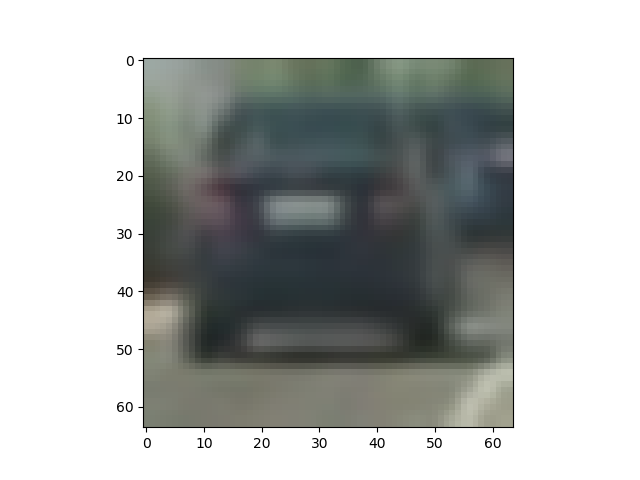
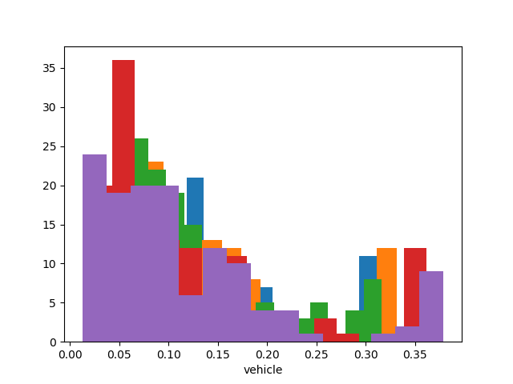
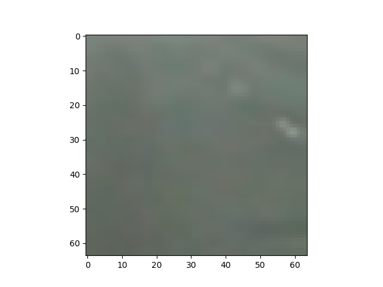
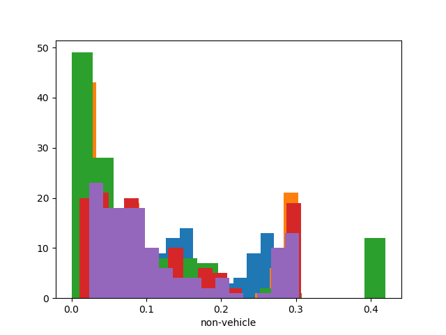

本算法数据集采用KITTI提取后的数据集

使用HOG（方向梯度直方图）进行特征提取：
$$
G(x,y)=H(x+1,y)-H(x-1,y)
$$

$$
G(x,y)=H(x,y+1)-H(x,y-1)
$$

式中$G_x(x,y),G_y(x,y),H(x,y)$分别表示输入图像中像素点(x,y)处的水平方向梯度、垂直方向梯度和像素值。

像素点(x,y)处的梯度幅值和梯度方向分别为：


$$
G(x,y) = \sqrt{G_x(x,y)^2+G_y(x,y)^2}
$$

$$
{\alpha}(x,y) =\frac{1}{{\tan}(\frac{G_y(x,y)}{G_x(x,y)})}
$$

将图像分为11*12的块的集合每块含有32个像素每个块有2个cell使用RGB彩色空间进行填充标记

使用以下设置处理原图片

> ```python
> 
> colorspace = 'RGB'  # Can be RGB, HSV, LUV, HLS, YUV, YCrCb
> orient = 11
> pix_per_cell = 32
> cell_per_block = 2
> hog_channel = 'ALL'  # Can be 0, 1, 2, or "ALL"
> ```

处理效果如下：











使用 LinearSVC DecisionTreeClassifier RandomForestClassifier三种方法训练数据集

数据集分类：

```python
# split train test
rand_state = np.random.randint(0, 100)
X_train, X_test, y_train, y_test = tts(dist_pickle['X'], dist_pickle['y'], test_size=0.2, random_state=rand_state)
```

结果如下表

| Method                   | Train Classfier Time | Test Accuracy | 1000 Sample Predict Time |
| ------------------------ | -------------------- | ------------- | ------------------------ |
| Linear SVC               | 0.38s                | 0.9561        | 0.02094s                 |
| Decision Tree Classifier | 4.07s                | 0.9099        | 0.01297s                 |
| Random Forest Classifier | 1.75s                | 0.9637        | 0.02294s                 |


```python
# RandomForestClassifier 0.95...
clf = RandomForestClassifier()
t1 = time.time()
clf.fit(X_train, y_train)
t2 = time.time()
print(round(t2 - t1, 2), 'Seconds to train classfier...')
# Check the score of the RFC
print('Test Accuracy of classfier = ', round(clf.score(X_test, y_test), 4))


print('My classifier predicts:', clf.predict(X_test[0:n_predict]))
print('For these', n_predict, 'labels: ', y_test[0:n_predict])
t2 = time.time()
print(round(t2 - t1, 5), 'Seconds to predict', n_predict, 'labels with classfier')

```

